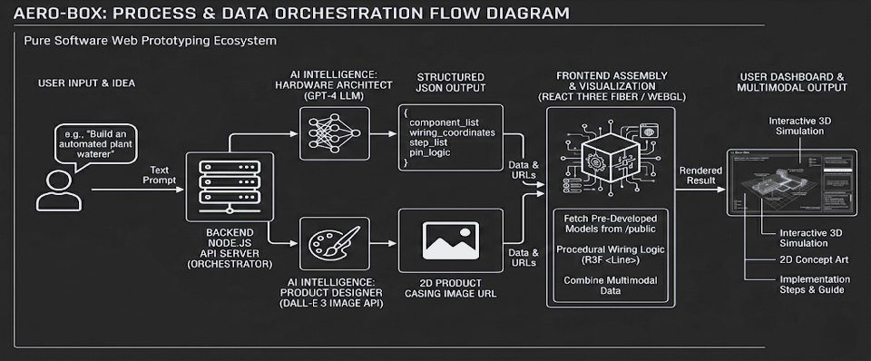

# 🚀 Aero-Box: AI-Powered Hardware Prototyping Sandbox
**AMD Ryzen Slingshot Hackathon 2026 Submission** | **Category:** Open Innovation  
**TEAM NAME - INVO-TEX**  
**TEAM Member 1 - Prasoon Mishra (Lead)**  
**TEAM Memeber 2 - Pratyush Kumar**  
**TEAM Memeber 3- Priyam Prakash** 

Aero-Box is a browser-based, AI-driven hardware sandbox that eliminates the need for physical components during the prototyping phase. By simply typing a prompt, users generate interactive 3D WebGL circuits, logical wiring maps, and 2D product casing concept art.

 *(Note: Create a docs folder and upload the diagrams here later)*

## 💻 Powered by the AMD Ecosystem
To ensure zero-latency 3D rendering and highly scalable AI routing, Aero-Box is architected around the AMD technology stack:
* **Edge Rendering:** The React Three Fiber (WebGL) frontend is optimized for **AMD Ryzen™ AI Processors**, ensuring smooth interactive 3D simulations directly in the browser utilizing integrated Radeon graphics.
* **Cloud Orchestration:** The Node.js multi-modal API router is designed to deploy on cloud instances powered by **4th Gen AMD EPYC™ processors**, handling high-throughput JSON and 3D asset delivery.
* **Enterprise Roadmap:** Future iterations will transition from public LLM APIs to custom, fine-tuned hardware-mapping models deployed via the **AMD ROCm™ open software platform** on **AMD Instinct™ accelerators** to guarantee corporate IP protection.

## 🏗️ Technical Stack
* **Frontend:** React.js, Vite, React Three Fiber (R3F), Drei
* **Backend:** Node.js, Express.js
* **AI Core:** OpenAI GPT-4o (Spatial JSON generation), DALL-E 3 (Concept Art)
* **Assets:** Pre-developed modular `.glb` component library

## ⚙️ How to Run Locally
1. Clone the repository.
2. Navigate to `/backend`, run `npm install`, and add your `OPENAI_API_KEY` to a `.env` file. Start the server with `node server.js`.
3. Navigate to `/frontend`, run `npm install`, and start the client with `npm run dev`.
